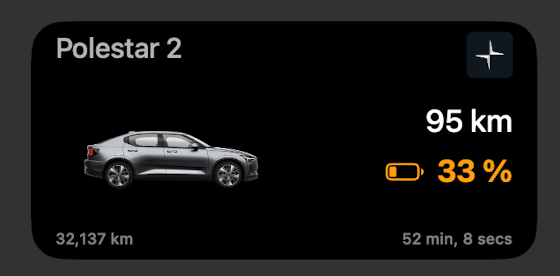
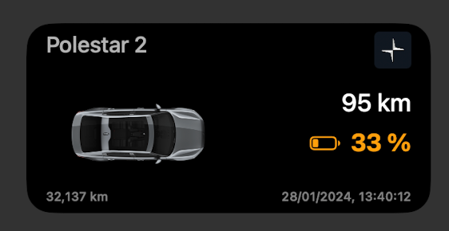
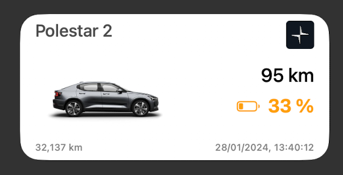
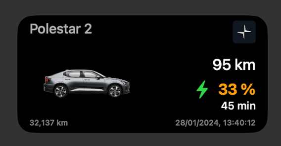
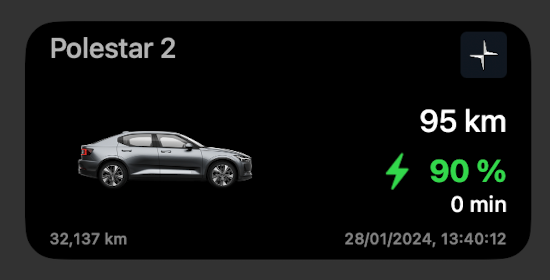
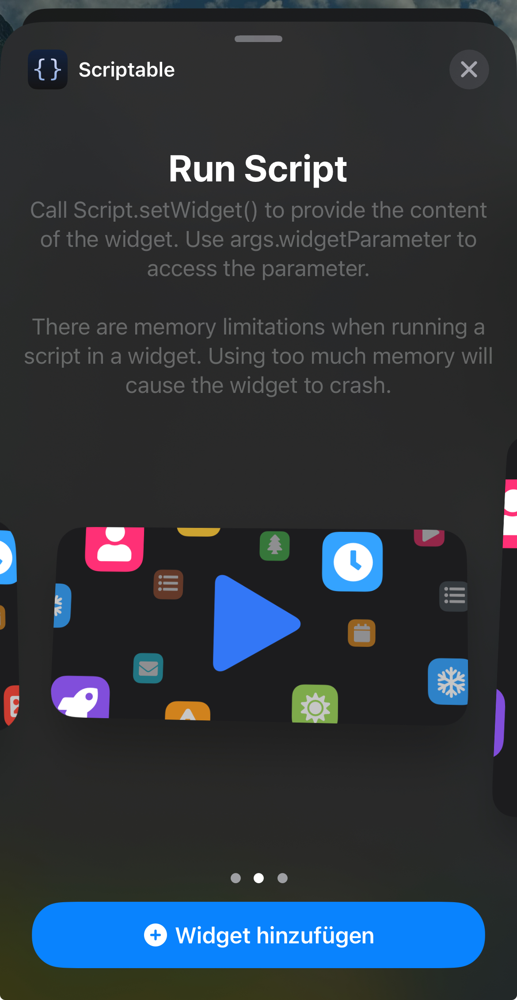

# Polestar SoC iOS Medium Widget

An iOS medium widget to display the current state of charge (SoC) of your Polestar.











## Background

Since the official Polestar App does not support any kind of widgets for iOS, I developed my own with the help of [Scriptable](https://scriptable.app/). It uses the official Polestar API which is also used to display the battery status in your profile at https://www.polestar.com.

> This widget is a hobby project and the developed code is not affiliated with Polestar AB or any Volvo company or any subsidiary or affiliate of any of the aforementioned companies.
## Prerequisites

1. Polestar Account login credentials which should work at https://polestarid.eu.polestar.com/PolestarLogin/ (optionally the VIN of your car if more than one car is linked to the account).
2. Install [Scriptable](https://apps.apple.com/de/app/scriptable/id1405459188) on your iPhone
3. [Optional but recommended] Follow the [ScriptDude installation steps](https://scriptdu.de/#installation)

## Installation

1. Make sure you have followed all mandatory steps described in [Prerequisites](./README.md#Prerequisites).

2. There are two options to install the widget:
    - [Recommended] Click on the following button to install via `ScriptDude` (make sure that you have followed step 3 of [Prerequisites](./README.md#Prerequisites)). ScriptDude will automatically receive updates of new versions of this widget

        [](https://scriptdu.de/?name=Polestar%20Medium%20SoC%20Widget&source=https%3A%2F%2Fgist.githubusercontent.com%2Fniklasvieth%2F159c13dd7ef94bd608358ce964b66c7c%2Fraw%2Fe05830e0f1b572089b99e73344ac192e8d7f808d%2Fpolestar-medium-widget.js&docs=https%3A%2F%2Fgithub.com%2Fniklasvieth%2Fpolestar-ios-medium-widget%2Fblob%2Fmain%2FREADME.md#generator)

    - Copy the content of [polestar-medium-widget.js](https://gist.github.com/niklasvieth/159c13dd7ef94bd608358ce964b66c7c), create a new script in `Scriptable`, paste the content and rename it to `Polestar Medium SoC Widget`.

3. Replace the placeholder values for `POLESTAR_EMAIL` and `POLESTAR_PASSWORD` with your Polestar login credentials.

    ```js
    // Mandatory Config
    const POLESTAR_EMAIL = "EMAIL";
    const POLESTAR_PASSWORD = "PASSWORD";
    ```

4. [Optional Configuration] You can decide if you prefer the relative live counter or the absolute timestamp for the last seen date in the widget footer. Default is the relative format. Change the value to `false` if you prefer the absolute date. You can additionally choose the angle of the image to be shown in the widget, change the battery color threshold values and enable miles instead of kilometer values.  

    ```js
    const IMAGE_ANGLE = "0"; // Possible values 0,1,2,3,4,5
    const RANGE_IN_MILES = false; // true
    const LAST_SEEN_RELATIVE_DATE = false; // true

    const MIN_SOC_GREEN = 60;
    const MIN_SOC_ORANGE = 30;
    ```
    
    Using the setting below you can override the default vehicle name (Polestar 1/2/3) to a name of your choice, similar to the app functionality
    ```js
    let VEHICLE_NAME; // default name 
    let VEHICLE_NAME = "Thor"; // change the name to "Thor"
    ``` 

5. Add the medium `Scriptable` widget to your homescreen. See [Apple How-To guide](https://support.apple.com/en-us/HT207122#:~:text=How%20to%20add%20widgets%20to%20your%20Home%20Screen).

    

6. Tab on the widget to configure the widget. Select `Polestar Medium SoC Widget` as script, leave everything else blank.

7. You should now be able to see the :battery: SoC of your Polestar on you homescreen. By clicking on the widget you will be navigated to the Polestar App.

8. [Optional] Mac users: You can even add the widget to you your Desktop or Notification Center if you have followed the above steps on you iPhone (see [Apple How-To Guide](https://support.apple.com/en-al/guide/mac-help/mchl52be5da5/mac#:~:text=Use%20iPhone%20widgets%20on%20your%20Mac)).

## Additional comments

There might be a minor lag or difference of the SoC compared to value displayed in the Polestar App because of the following reason:

- The refresh interval of the widget is determined by iOS itself.

The widget supports light and dark mode. The mode is automatically fetched from your settings. If you want to enable or disable dark mode via

```js
const DARK_MODE = true // false
```

### Appreciation

- Thanks @simonbs for the awesome [Scriptable](https://scriptable.app/) app.

### Support me

[](https://www.buymeacoffee.com/niklasvieth)

<a href="https://www.paypal.me/niklasvieth" >
  
</a>